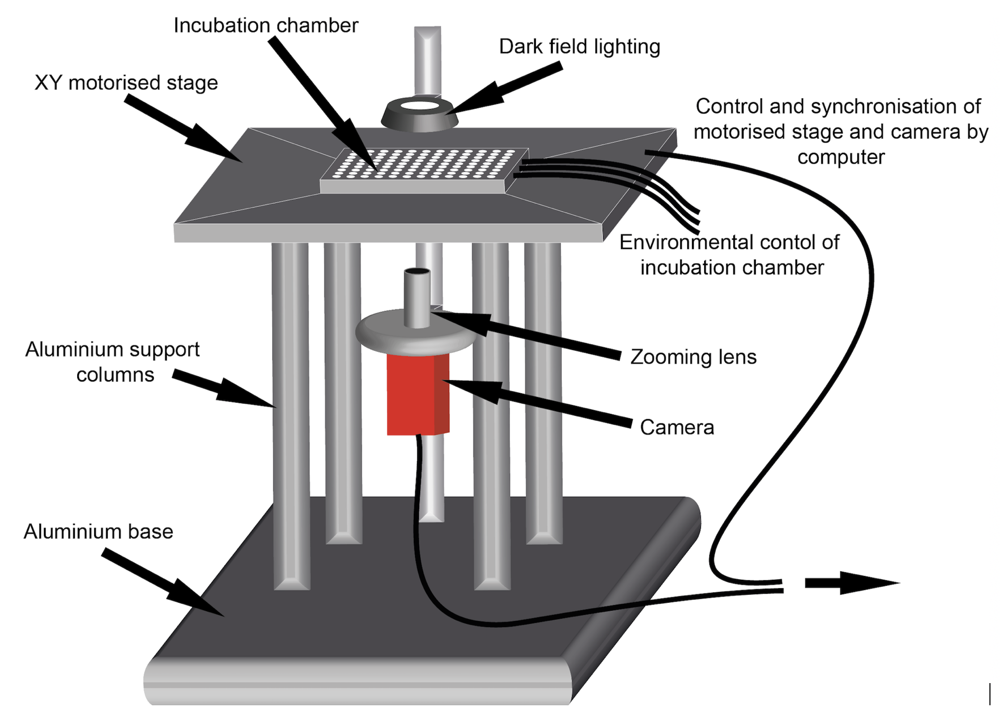
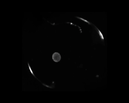
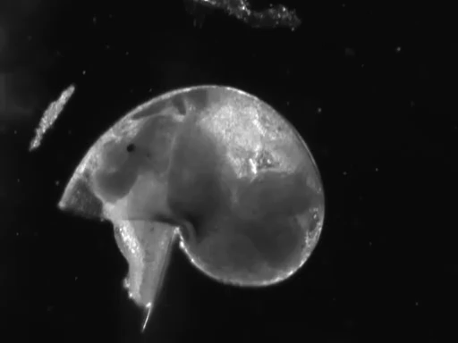
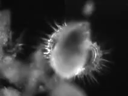
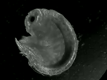
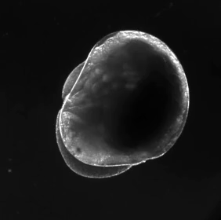
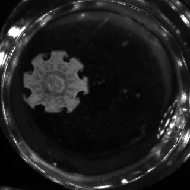
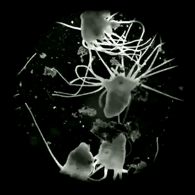
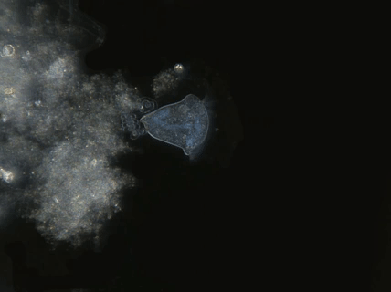
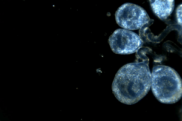

## Welcome to the documentation for OpenVIM - an open-source video microscope

### What is OpenVIM?
OpenVIM is a modular video microscope developed by a team of scientists to record the dynamic process of biological development in large numbers of aquatic embryos over prolonged periods. It has proven effective for capturing complex responses of embryos and larvae and is supporting a new approach to visualising this fascinating period.

See: [Embryonic development Vimeo Channel](www.vimeo.com/channels/embryonicdevelopment) to see example video generated using OpenVIM.

## How does OpenVIM differ from a traditional microscope?
A number of things make OpenVIM different to a traditional microscope
 * OpenVIM is entirely digital and does not contain eye pieces, unlike a traditional microscope. It relies on a high quality machine vision camera to acquire images.
 * OpenVIM uses optics with a high depth of field - allowing the entire depth of large numbers of embryos to be acquired in focus over prolonged periods
 * OpenVIM encompasses tight control over the embryonic environment (temperature, nitrogen, oxygen, carbon dioxide and humidity) over a prolonged period
 * OpenVIM uses an automated XY stages to enable the acquisition of images of multiple embryos over a prolonged period.
 * OpenVIM is controlled using MicroManager www.micromanager.org an open-source plugin for image acquisition, run within ImageJ, the popular image analysis software
 * OpenVIM is versatile - optics, cameras, motorised stages, lighting, incubation requirements can all be chosen to be most applicable to an application or budget

## What can OpenVIM do?
Capturing the dynamic process of embryonic development in large numbers of embryos, whilst maintaining an experimental treatment is formidible. OpenVIM was designed to capture images of many embryos at different temporal scales, allowing both biological responses apparent in realtime and responses that are only visible over longer temporal scales to be captured. OpenVIM can run automously over prolonged periods. It has been used for experiments lasting from just a few hours, to experiments running over several months.

## What species has OpenVIM been used to visualise?

OpenVIM has been used to visualise the early life stages of a range of species. These

### Molluscs

| Species     | Description | Output | Publications |
| ------------- | ------------- | ------------- | ------------- |
| *Radix balthica* | freshwater pond snail |  | [Tills et al 2013 Biol J Linn Soc](https://academic.oup.com/biolinnean/article/110/3/581/2415874)  |
| *Lymnaea stagnalis* | freshwater pond snail|   | - | - |
 | *Littorina obtusata* | intertidal marine snail |  | [Truebano et al 2018 JEB](http://jeb.biologists.org/content/221/8/jeb171629)  
| *Littorina littorea* | intertidal marine snail |  |  - |

### Crustaceans

| Species     | Description | Output | Publications |
| ------------- | ------------- | ------------- | ------------- |
| *Gammarus chevreuxi*  | marine amphipod | | - |
| *Orchestia gammarellus*  | supralittoral marine amphipod   |  | - |
|* *Artemia franciscana*   |  brine shrimp   | - | - |

### Cnidaria

| Species     | Description | Output | Publications |
| ------------- | ------------- | ------------- | ------------- |
| *Aurelia aurita* ephyra | jellyfish larva | | [Tills et al 2016 JEMBE](https://www.sciencedirect.com/science/article/pii/S0022098116300491) |
| *Aurelia aurita* polyps| jellyfish benthic stage | | - |

### Fish

| Species     | Description | Output | Publications |
| ------------- | ------------- | ------------- | ------------- |
|*Danio rerio* | zebrafish |   -   | [Tills et al 2013 BMC Bioinformatics](https://bmcbioinformatics.biomedcentral.com/articles/10.1186/1471-2105-14-37) |
| " | " |   -   |[Rudin-Bitterli et al 2014](http://journals.plos.org/plosone/article?id=10.1371/journal.pone.0113235) |

### Amphibians

| Species     | Description | Output | Publications |
| ------------- | ------------- | ------------- | ------------- |
| *Xenopus laevis* | African clawed frog | - | [Tills et al 2013 BMC Bioinformatics](https://bmcbioinformatics.biomedcentral.com/articles/10.1186/1471-2105-14-37)|

### Protozoa

| Species     | Description | Output | Publications |
| ------------- | ------------- | ------------- | ------------- |
| *Vorticella similis* | freshwater Protozoa | | - |
| Marine vorticella | marine Protozoa | | [Discover Osmosis Educational Resource](http://www.discoverosmosis.com)|

 
### How do I develop an OpenVIM?
A parts list for OpenVIM can be found here [parts-list](parts.md) and a user group for embryo-phenomics more broadly is accessible here -[Embryo-phenomics user group](https://groups.google.com/forum/#!forum/embryo-phenomics)
