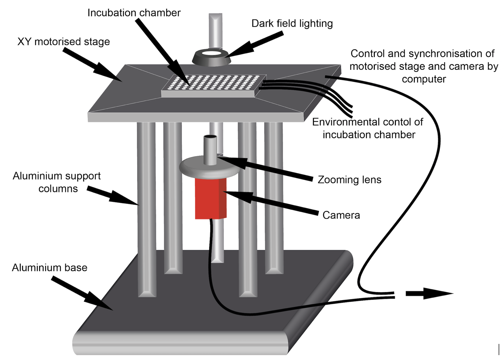

## Welcome to the documentation for OpenVIM - an open-source video microscope


### What is OpenVIM?
OpenVIM is a modular video microscope developed by a team of scientists to record the dynamic process of biological development in large numbers of aquatic embryos over prolonged periods. It has proven effective for capturing complex responses of embryos and larvae and is supporting a new approach to visualising this fascinating period.



See: [Embryonic development Vimeo Channel](www.vimeo.com/channels/embryonicdevelopment) to see example video generated using OpenVIM.

## What can OpenVIM do?

one


## How does OpenVIM differ from a traditional microscope?
A number of things make OpenVIM different to a traditional microscope
[x] OpenVIM is entirely digital and does not contain eye pieces, unlike a traditional microscope. It relies on a high quality machine vision camera to acquire images.
[x] OpenVIM uses optics with a high depth of field - allowing the entire depth of large numbers of embryos to be acquired in focus over prolonged periods
[x] OpenVIM encompasses tight control over the embryonic environment (temperature, nitrogen, oxygen, carbon dioxide and humidity) over a prolonged period
[x] OpenVIM uses an automated XY stages to enable the acquisition of images of multiple embryos over a prolonged period.
[x] OpenVIM is controlled using MicroManager www.micromanager.org an open-source plugin for image acquisition, run within ImageJ, the popular image analysis software
[x] OpenVIM is versatile - optics, cameras, motorised stages, lighting, incubation requirements can all be chosen to be most applicable to an application or budget


## What can OpenVIM do?

one


two


three

<a href="radixDevelopment.gif" title= "Mult temp res 2", width = "500">

four 
{:class="img-responsive"}

sdf
is You can use the [editor on GitHub](https://github.com/otills/openvim/edit/master/README.md) to maintain and preview the content for your website in Markdown files.

Whenever you commit to this repository, GitHub Pages will run [Jekyll](https://jekyllrb.com/) to rebuild the pages in your site, from the content in your Markdown files.

### Markdown

Markdown is a lightweight and easy-to-use syntax for styling your writing. It includes conventions for

```markdown
Syntax highlighted code block

# Header 1
## Header 2
### Header 3

- Bulleted
- List

1. Numbered
2. List

**Bold** and _Italic_ and `Code` text

[Link](url) and 
```

For more details see [GitHub Flavored Markdown](https://guides.github.com/features/mastering-markdown/).

### Jekyll Themes

Your Pages site will use the layout and styles from the Jekyll theme you have selected in your [repository settings](https://github.com/otills/openvim/settings). The name of this theme is saved in the Jekyll `_config.yml` configuration file.

### Support or Contact

Having trouble with Pages? Check out our [documentation](https://help.github.com/categories/github-pages-basics/) or [contact support](https://github.com/contact) and we’ll help you sort it out.
