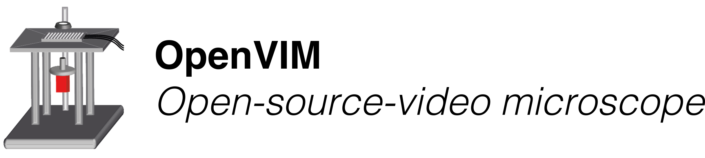
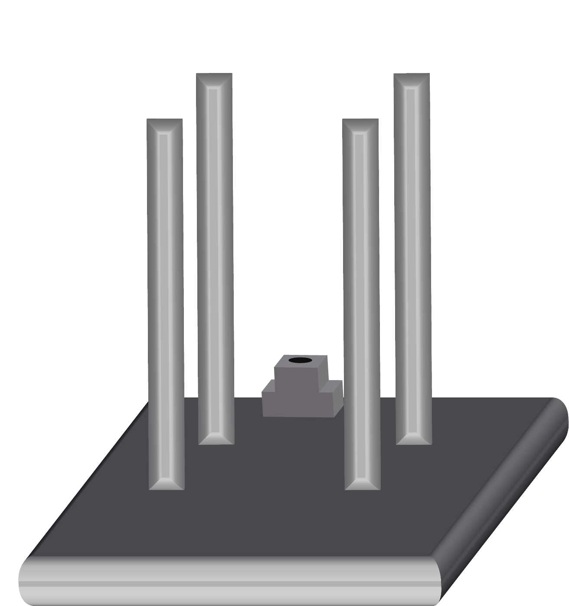
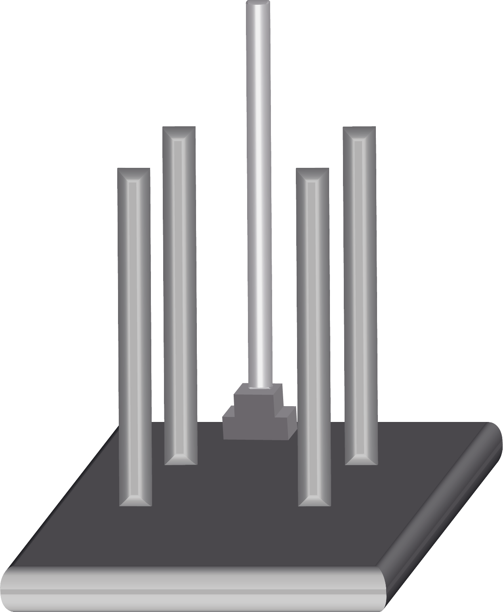
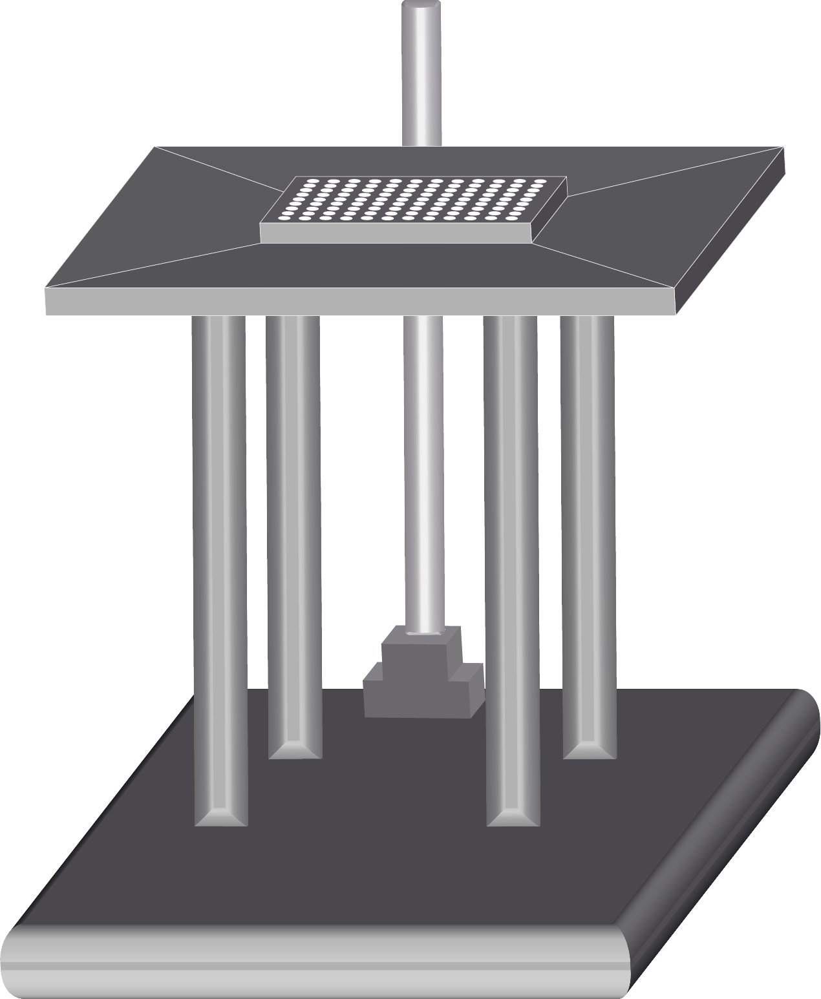
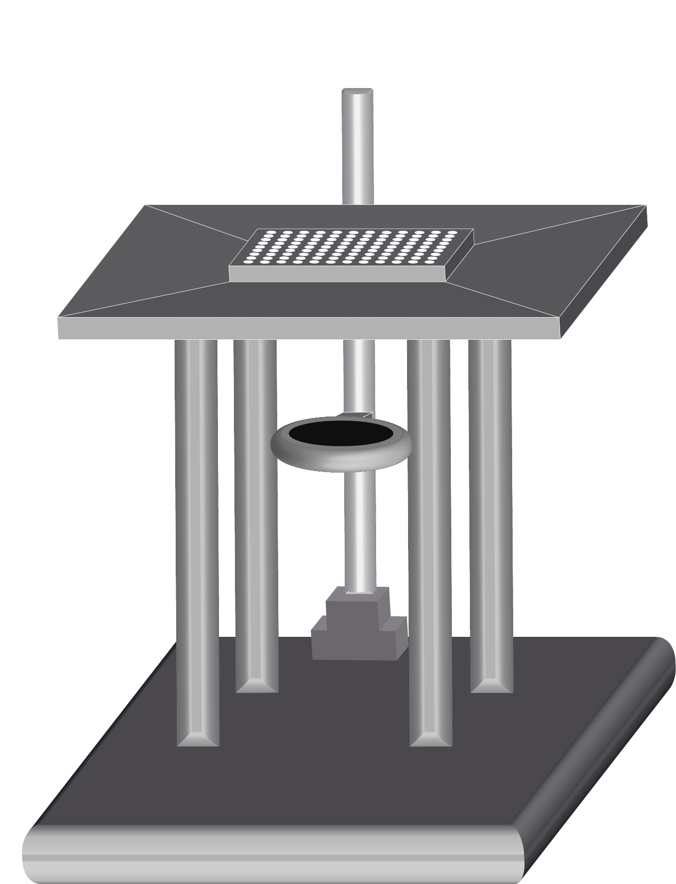
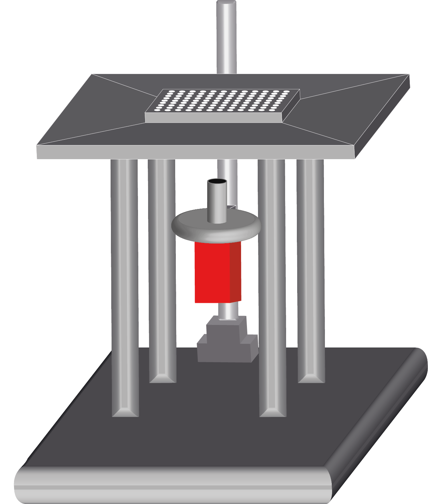
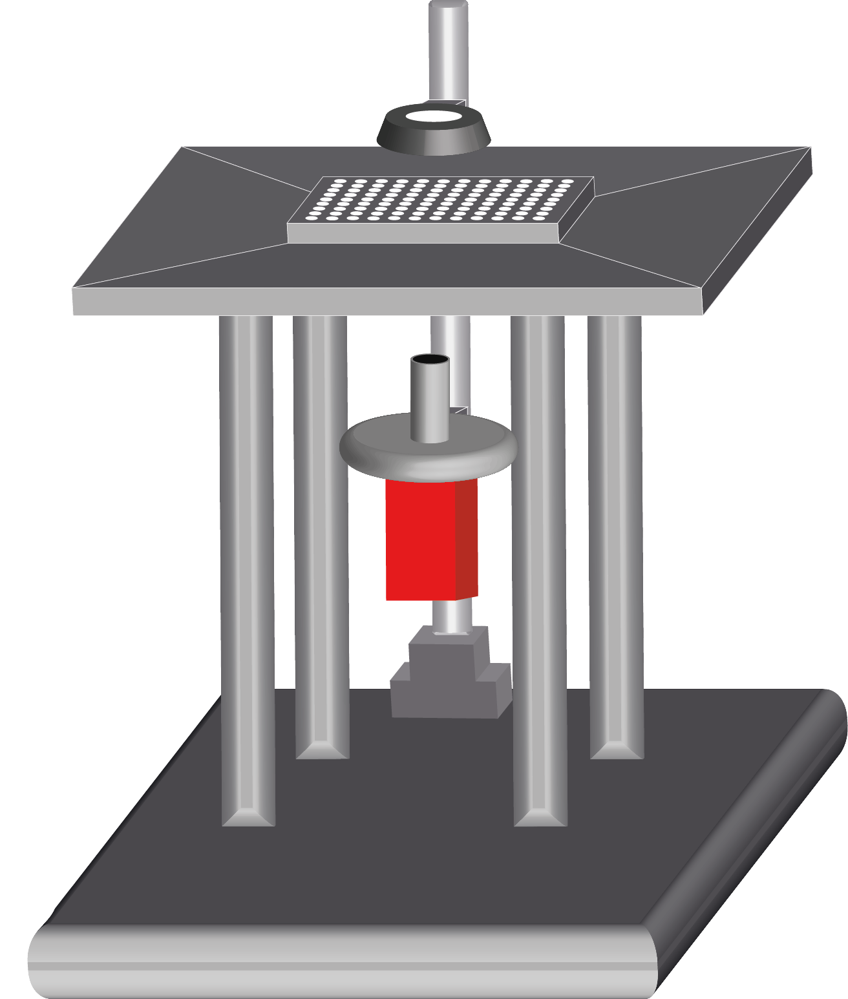

<h3 align="left">Assembling an OpenVIM</h1>

An OpenVIM can use a range of different [components](parts.md), but the assembly once these are chosen and the relevant custom parts are machined is quite straight forward.

---
#### Attach legs to support the XY stage
 

**i)** : Feed machine bolts from below the pre-drilled holes in the aluminium base to the tapped holes in each aluminium leg and tighten

---
#### Attach aluminium optic support block
 

**ii)** : Feed machine bolts downwards through the optic support block and into the threaded holes in the alumnium base

---

#### Insert stainless steel support pole for the optics
 

**iii)** : Insert the stainless steel support pole for the optics into the aluminium optic support block and tighten the grub screws to secure.

--- 
#### Attach motorised stage to aluminium support legs
 

**iv)** : Use machine head bolts to secure the motorised stage to the alumnium support legs, taking care to not exert any mechanical force over the stage. If holes fail to align, try loosening the bolts securing the legs to the base to allow the centers to locate correctly.

---
#### Attach the lens mount to the stainless steel optic support pole
 

**v)** : Slide the lens holder and mount down the stainless steel optic support pole.

---

#### Insert the lens into the support mount and attach camera
 

**vi)** :Insert the lens into the support mount inverted and tighten. Then attach the lens to the camera in an inverted  orientation.

---

#### Attach lighting mount to the stainless steel optic support pole and attach LED ringlight
 

**vi)** :Slide the lighting mount down the stainless steel optic support pole and screw the LED ringlight to the support. Note holes will be determined by the LED, but manufacturers supply the drawings for relative mounting hole locations.
---
