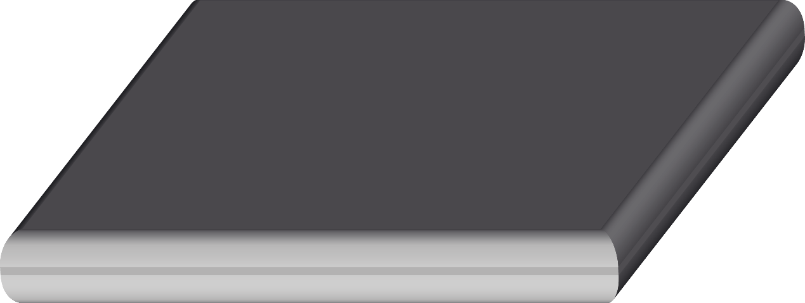
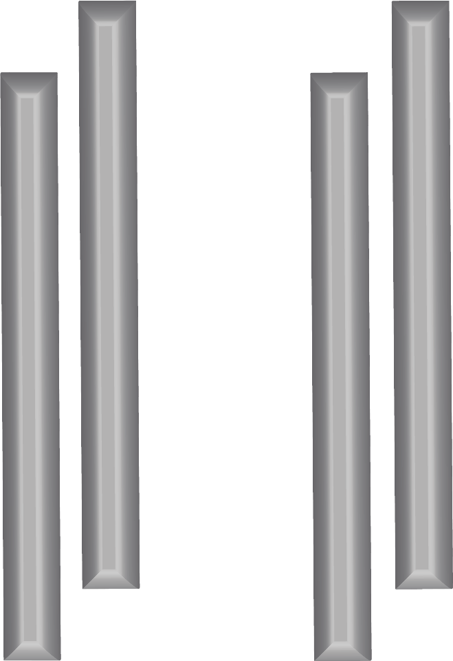

<h3 align="left">Choosing components</h1>

OpenVIM is modular and can be used with a large variety of different parts. This page details the parts that have been used succesfully with OpenVIM. The biggest consideration when choosing parts is that the necessary MicroManager drivers are available [Micro-Manager supported hardware](https://micro-manager.org/wiki/Device_Support).

### Custom parts
OpenVIM requires some custom components and these are best created in partnership with a workshop. 

| Part     |  | Specification | 
| ------------- | ------------- | ------------- | 
| Aluminium base |  | HE9 alumnium - 20 mm x 300 mm x 220 mm  |
| Aluminium legs |  | HE9 alumnium pole - 25 mm diameter x 600 mm   |
| Aluminium optic support block |  | HE9 alumnium block - 25 mm diameter x 600 mm   |
| Stainless steel optic pole |  | 304 stainless steel pole, 15 mm diameter x 900 mm   |
| Delrin lens support mount |  | Delrin machined using laithe   |

#### Lenses
* [Keyence VHZ20R](https://www.keyence.co.uk/products/microscope/digital-microscope/vhx-1000/models/vh-z20r/index.jsp) - Extremely high depth of field lens, excellent for low magnification imaging of aquatic embryos, 20-200 X digital magnification.
* [Keyence VHZ100R](https://www.keyence.com/products/microscope/digital-microscope/vh_lens/models/vh-z100r/index.jsp) - High depth of field 100 - 1000 X digital magnification lens)
* [Keyence VHZ500R](https://www.keyence.co.uk/products/microscope/digital-microscope/vhx-6000/models/vh-z500r/index.jsp) - 500 - 5000 X digital magnification, good for imaging Protozoa.
* [Qioptiq Optem Micro Lens](http://www.qioptiq.com/optem-micro-12-5.html) - Highly modular lens system with a wide range of magnification using combinations of auxillary lenses and TV tubes.

#### Lighting
* [CCS LDR2-42-SW2](https://www.ccs-grp.com/products/series/1) - An angled 42 mm OD LED ring light for focussed dark field lighting
* [Keyence CA-DRW4F](https://www.keyence.com/products/vision/vision-sys/ca-d/models/ca-drw4f/index.jsp) - A non-focussed 43 mm OD LED ring light.
* [Schott EasyLED gooseneck lights](https://www.schott.com/lightingimaging/english/microscopy/products/easyled/spotlights.html) - A useful lighting apparatus for imaging different types of speciment, although less suited to repeatable lighting.

#### Motorised stages
* [Marzhauser SCAN IM 130 x 85](https://www.marzhauser.com/en/products/microscope-stages/motorized-microscope-stages/scan-series/scan-im.html) - The Marzhauser Scan Tango XY stage is a very reliable and robust stage with very good technical and MicroManager support. Platform independant MicroManager support. Controlled with the [Tango Desktop controller](https://www.marzhauser.com/en/products/controllers/tango-desktop.html) 
* [Prior ES111 Optiscan stage](https://www.prior.com/product/optiscan-es111) - A cost effective stage with platform independant MicroManager support. Controlled with previous versions of the [ES11 Controller](https://www.prior.com/product/optiscan-es111).
* [Prior ES107 Inverted Optiscan stage](https://www.prior.com/product/optiscan-es107) - An inverted XY stage, good for samples requiring high magnification to get the necessarily small working distance required, for example using the VHZ500R lens. Note that this lens requires different support leg offsets in the alumnium base owing to its greater footprint.

#### Cameras
* [Allied Vision Technologies Pike 421B](https://www.alliedvision.com/en/products/cameras/detail/Pike/F-421.html) - An excellent camera for darkfield imaging, used with dc1394b FW800 connection. Great MicroManager support owing to new developments with the IIDC driver. Allows custom ROI, recording of full 14 bits and precise manipulation of frame rates via control over packet size. Image capture time is recorded with high precision. Recently discontinued due to sensor no longer being available, but Allied Vision Technology USB 3.0 equivalents available. 
* Allied Vision Technologies Pike 421C. As above, but colour model.
* Allied Vision Technologies Pike 210C. A lower resolution model of the Pike 421C colour camera.
* [The Imaging Source](https://www.theimagingsource.com/products/industrial-cameras/) - various colour and monochrome models from the DMK range used.
* QImaging Retiga (R3 and R6)[https://www.qimaging.com/products/cameras/scientific/] - USB 3.0 cameras available in monochrome and colour, with excellent image quality. However, note that drivers for MicroManager are only available for Windows.

#### Incubation chambers
* [Oko-lab Cryo Boldline](http://www.oko-lab.com/live-cell-imaging/heating-cooling/temperature/h101-cryo-bl-heating-cooling) - allows heating and cooling of samples in multiwell plates, with humidification (to reduce evaporation) and excellent data logging facilities. Can also be used with [gas mixing modules](http://www.oko-lab.com/gas-mixing/for-microscope-incubators/co2-o2-unit-bl-0-20-1-95), including combined mixing of nitrogen, oxygen and carbon dioxide. OKO-Labs can design gas mixing units to user specifications if required.
* [Oko-lab electrically heated chamber](http://www.oko-lab.com/live-cell-imaging/stage-top-manual-or-premixed/discontinued/uno-combined-controller) - Allows heating of sample within multiwell plates using electrical filament heaters built into an incubation chamber. System integrates this with data logging and controlled temperature humidification. This particular model is discontinued.

[Return to OpenVIM homepage](README.md)
