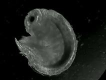
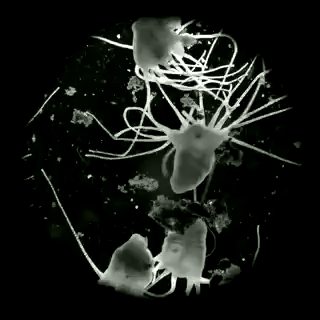
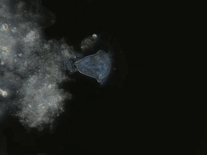
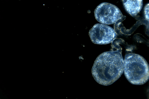

<h2 align="left">Species visualised using OpenVIM</h1>
<h4 align="left">https://www.vimeo.com/channels/embryonicdevelopment</h1>

### Molluscs

| Species     | Description | Output | Publications |
| ------------- | ------------- | ------------- | ------------- |
| *Radix balthica* | freshwater pond snail |  | [Tills et al 2013 Biol J Linn Soc](https://academic.oup.com/biolinnean/article/110/3/581/2415874)  |
| *Lymnaea stagnalis* | freshwater pond snail|   | - | - |
 | *Littorina obtusata* | intertidal marine snail |  | [Truebano et al 2018 JEB](http://jeb.biologists.org/content/221/8/jeb171629)  
| *Littorina littorea* | intertidal marine snail |  |  - |

### Crustaceans

| Species     | Description | Output | Publications |
| ------------- | ------------- | ------------- | ------------- |
| *Gammarus chevreuxi*  | marine amphipod | | - |
| *Orchestia gammarellus*  | supralittoral marine amphipod   |  | - |
|* *Artemia franciscana*   |  brine shrimp   | - | - |

### Cnidaria

| Species     | Description | Output | Publications |
| ------------- | ------------- | ------------- | ------------- |
| *Aurelia aurita* ephyra | jellyfish larva | | [Tills et al 2016 JEMBE](https://www.sciencedirect.com/science/article/pii/S0022098116300491) |
| *Aurelia aurita* polyps| jellyfish benthic stage | | - |

### Fish

| Species     | Description | Output | Publications |
| ------------- | ------------- | ------------- | ------------- |
|*Danio rerio* | zebrafish |   -   | [Tills et al 2013 BMC Bioinformatics](https://bmcbioinformatics.biomedcentral.com/articles/10.1186/1471-2105-14-37) |
| " | " |   -   |[Rudin-Bitterli et al 2014](http://journals.plos.org/plosone/article?id=10.1371/journal.pone.0113235) |

### Amphibians

| Species     | Description | Output | Publications |
| ------------- | ------------- | ------------- | ------------- |
| *Xenopus laevis* | African clawed frog | - | [Tills et al 2013 BMC Bioinformatics](https://bmcbioinformatics.biomedcentral.com/articles/10.1186/1471-2105-14-37)|

### Protozoa

| Species     | Description | Output | Publications |
| ------------- | ------------- | ------------- | ------------- |
| *Vorticella similis* | freshwater Protozoa | | - |
| Marine vorticella | marine Protozoa | | [Discover Osmosis Educational Resource](http://www.discoverosmosis.com)|
